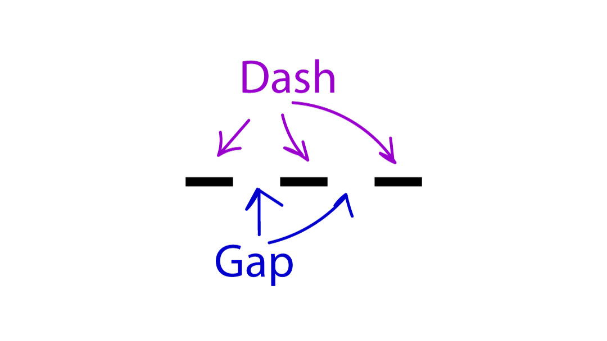
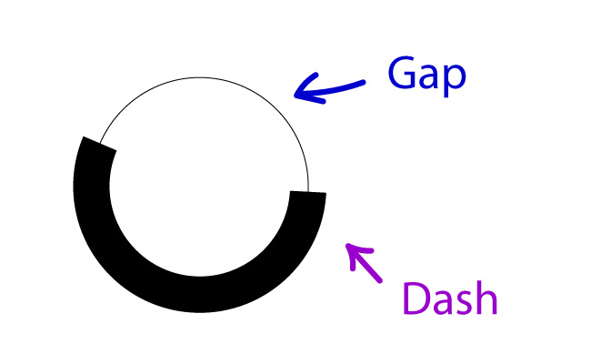

# Pie Chart Exercise 

## Focus
With this exercise, we aim to explain how to creatively use some nice features of CSS, which in association with Vue, helps create dynamics layouts.
We will create a simple Vue component that represents a Stacked Pie Chart.
To create the Pie Chart, we use one circle for each data and a `stroke-dasharray` to color the desired slice.
Every slice will be animated with a rotation, and, on hover, a tooltip with the relative info will be visualized.

This is the result: 
[Screen recording](./screens/PieChart-screen-record.mp4)

----------
### Previous knowledge
- HTML 
	- svg
	- circle
	- mask
- CSS
	- flex
	- custom props
	- transform
	- stroke
	- stroke-dasharray
	- stroke-width
	- animations
- Vue
	- Typescript basics
	- script setup
	- v-for cycle
	- methods
	- computed

### Exercise
Let's start creating a Vue 3 project, we'll use Typescript and VueRouter.

First, we create three empty files:
`views/ChartView.vue`
`components/PieChart.vue`
`types/chart.d.ts`

ChartView is a very simple view. 
Inside that, we put some mock data, and we pass it to the PieChart component.

ChartView.vue
```vue
<script setup lang="ts">
	import PieChart from "@/components/PieChart.vue"

	//mock data
	const data = [
		{
			label: "Lorem",
			quantity: 70,
			color: "hsl(20 60% 50%)",
		},
		{
			label: "Ipsum Dolor",
			quantity: 10,
			color: "hsl(180 60% 50%)",
		},
		{
			label: "Sit",
			quantity: 20,
			color: "hsl(200 60% 50%)",
		},
	]
</script>
<template>
	<main>
		<header><h2>Pie Chart</h2></header>
		<PieChart v-if="data?.length" :data="data" />
	</main>
</template>

<style scoped>
	h2 {
		color: white;
		text-align: center;
		text-transform: uppercase;
		font-weight: bold;
		font-size: 2rem;
	}
	main {
		display: flex;
		flex-direction: column;
		justify-content: space-between;
		block-size: 100%;
		padding: 2rem;
	}
</style>

```

In the `router/index.ts`, we set this view as a component in the home route.

```ts
import { createRouter, createWebHistory } from "vue-router"
import ChartsView from "../views/ChartsView.vue"

const router = createRouter({
	history: createWebHistory(import.meta.env.BASE_URL),
	routes: [
		{
			path: "/",
			name: "home",
			component: ChartsView,
		},
	],
})

export default router
```

In `chart.d.ts` we insert the PieData Type

```ts
export type PieData = {
	label: string
	quantity: number
	color: string
}
```


We are ready to work on the PieChart component.
Let's start!

Our scope is to create from this data a graph. 
Each element is represented by a slice, the size of which is proportional to the total percentage.
We use an SVG to draw the Pie, and each slice will be a circle with only one colored piece of the circumference.

First we insert two props 
```html
<script setup lang="ts">
	import { computed, type PropType } from "vue"
	import type { PieData } from "@/types/chart"

	const props = defineProps({
		data: {
			type: Object as PropType<PieData[]>, 
			required: true,
		},
		animationDuration: {
			type: Number,
			default: 1,
		},
	})
```

To create the SVG we need some constants:
```js
	//the radius of the circle
	const radius = 16
	//the size of the viewbox (a square)
	const viewbox = radius * 2
	//the circumference of the circle, we need it to calculate the slices sizes
	const circumference = 2 * Math.PI * radius
	//furthermore we create a mask for every slice to create a stacked pie chart
	const minRadiusMask = radius - props.data.length
	
	const strokeWidth = 23
```

Let's view the template
```html
<template>
	<div class="data__pie">
		<!--we set the viewbox-->
		<svg :viewBox="`0 0 ${viewbox} ${viewbox}`">
			<!--ve use a template for the v-for-->
			<template v-for="(datum, idx) in data" :key="`${datum.label}-${idx}`">
				<!-- for each data we have a mask -->
				<!-- we need an id to link the mask -->
				<mask :id="getId(datum.label, idx)">
					<!-- each mask has a different radius. We start from the lowest -->
					<!-- and we set the center of the circle at the center of the viewbox -->
					<circle :r="minRadiusMask + idx" :cx="radius" :cy="radius" fill="white" />
				</mask>

				<!-- for each data we have a group -->
				<g>
					<!--
						Vue 
							We use our constants to populate the circle attributes
							each circle has a related mask
						CSS 
							each circle has its own: 
							custom props to change the animation and color
							stroke-dasharray
							stroke-width
		
					-->
					<circle
						:r="radius"
						:cx="radius"
						:cy="radius"
						:mask="`url(#${getId(datum.label, idx)})`"
						class="data__pie-slice"
						:style="`
							--rotate: ${getRotate(idx)}deg; 
							--color: ${datum.color}; 
							--delay: ${getDelay(idx)};
							stroke-dasharray:${getSlice(datum.quantity)}px, ${circumference}px; 
							stroke-width: ${strokeWidth};
						`"
					>
						<!-- The title is for accessibility and the tooltip -->
						<title>{{ datum.label }}: {{ datum.quantity }}%</title>
					</circle>
				</g>
			</template>
		</svg>
	</div>
</template>

```

Let's view the attributes in detail.
`r, cx, cy` are equal to each other 
The `style` is how we set the color of each slice and the right size.
To color the slice, we use `stroke-dasharray`.
This property accepts a list of comma separated numbers or percentages as values.
The odd numbers are the length of the painted part (dash), and the even numbers are the non-painted part (gap).



In our case, we need to color only a slice, so the dash is the "slice size", and the gap is the "circumference", so the second dash is not visible.



The `stroke-width` is lower than the `viewbox` size to create a hole in the middle of the Pie.

In the style we have some common rules:

```vue
<style scoped>
	.data__pie {
		display: flex;
		justify-content: center;
		align-items: center;
		inline-size: 100%;
		block-size: 30rem;
		overflow: hidden;
	}
	.data__pie svg {
		inline-size: 30rem;
		fill: none;
	}
	.data__pie circle {
		cursor: pointer;
	}
	.data__pie circle:hover {
		filter: brightness(0.8);
	}
</style>
```

In the style attribute if the circle we have passed three custom props

```js
--rotate: ${getRotate(i)}deg; 
--color: ${datum.color}; 
--delay: ${getDelay(i)};
```

`--rotate` is the angle that we use to rotate in the right position the slice, we'll see how to calc it in a little while.
`--color` is the color of the stroke
`--delay` is the value of the animation-delay 

We use the custom properties to use the same rule in the CSS and change  the value dynamically with a `computed`.

This is the updated CSS
```css
	.data__pie circle {
		cursor: pointer;
		/*We need to set the origin to the center for the rotation*/
		transform-origin: center center;
		animation: rotate;
		animation-iteration-count: 1;
		/* the circle retains the properties set at the end of animation */
		animation-fill-mode: forwards;
		/* The v-bind method is useful to populate the CSS with props and computed that do not need other parameters. */
		animation-duration: v-bind(duration);
		/*Each circle has its own delay and color*/
		animation-delay: var(--delay);
		stroke: var(--color);
		opacity: 0;
	}
	.data__pie circle:hover {
		filter: brightness(0.8);
	}

	@keyframes rotate {
		0% {
			opacity: 0;
			transform: rotate(-180deg);
		}
		100% {
			opacity: 1;
			/*Each circle has its own rotation*/
			transform: rotate(var(--rotate));
		}
	}
```

Now that we have seen the css and the template, we can see the logic that we use to calculate the sizes and the rotations.

```js
	//these constants are used to draw the pie
	//the radius of the circle
	const radius = 16
	//the size of the viewbox (a square)
	const viewbox = radius * 2
	//the circumference of the circle, we need it to calculate the slices sizes
	const circumference = 2 * Math.PI * radius
	//furthermore we create a mask for every slice to create a stacked pie chart
	const minRadiusMask = radius - props.data.length
	//we will see this in a little while
	const strokeWidth = 23

	//It is possible that the sum of quantities is bigger than 100%
	//We use a computed to calculate the total quantity
	const totalPercentage = computed(() =>
		props.data.reduce((accumulator, element) => {
			return accumulator + element.quantity
		}, 0)
	)
	//and a method to calculate the single percentage from this total
	const getSinglePercentage = (quantity: number) => (quantity * 100) / totalPercentage.value

	//we calculate the single percentage in relation to the circumference
	const getSlice = (quantity: number) => {
		return (circumference * getSinglePercentage(quantity)) / 100
	}

	//Every element is rotated starting from the position of the previous, we have a circle, so we need to calculate the percentage in relation to 360deg.
	const getRotate = (index: number) => {
		let angle = 0
		let counter = 0
		while (counter < index) {
			angle += (getSinglePercentage(props.data[counter].quantity) / 100) * 360
			counter++
		}
		return angle
	}

	//We use the duration inside the CSS with v-bind, but we need to add the unit
	const duration = computed(() => `${props.animationDuration}s`)

	//Each circle has its calculated delay
	const getDelay = (index: number) => `${0.5 + index / 3}s`

	//Mask and circle need an id to be bound to each other.
	const getId = (label: string, index: number) => `${label.replace(" ", "-")}-${index}`
```

**The Pie Chart is ready!**

But we can improve it.
I suggest you some possible updates.

What if we want to create a customized tooltip?
Or add text inside the slice?

That's it! 😎

I hope you have enjoyed the exercise.


